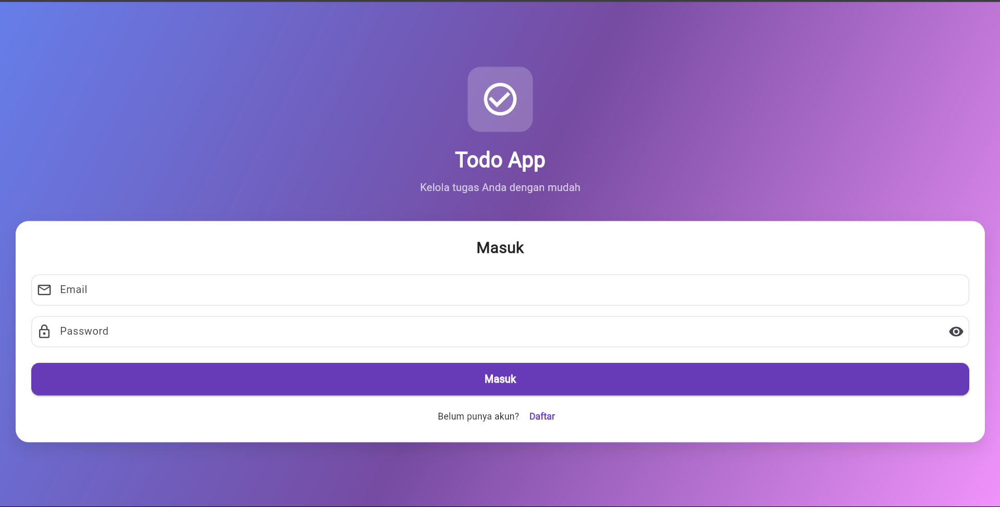
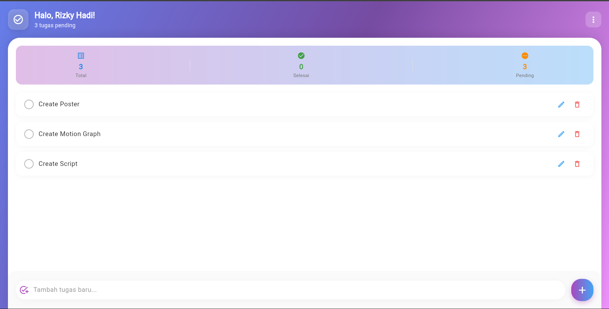
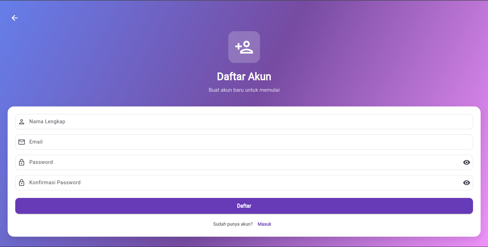

# TodolistApp

## a. Nama

Mohammad Rizky Hadi (mrizk-dyy)

## b. Judul Project

Aplikasi To-Do List dengan Firebase Authentication

## c. Deskripsi Fungsionalitas Aplikasi

TodolistApp adalah aplikasi manajemen tugas harian berbasis Flutter yang memungkinkan pengguna untuk:

- Mendaftar dan login menggunakan Firebase Authentication.
- Menambahkan, mengedit, dan menghapus daftar tugas.
- Menyimpan data pengguna secara realtime di Firebase.
- Menandai tugas sebagai selesai atau belum selesai.

## d. Teknologi yang Digunakan

- Flutter
- Dart
- Firebase Authentication
- Firebase Realtime Database (atau Firestore)

## e. Cara Menjalankan Aplikasi

1. Clone repository ini:
   ```bash
   git clone https://github.com/mrizk-dyy/todolistapp.git
   ```
2. Buka folder project dengan VS Code atau Android Studio.
3. Jalankan perintah:
   ```bash
   flutter pub get
   ```
4. Konfigurasikan Firebase:
   - Buat project di [Firebase Console](https://console.firebase.google.com/)
   - Unduh file `google-services.json` dan tempatkan di folder `android/app`
   - Tambahkan konfigurasi Firebase ke file `firebase_options.dart` atau gunakan CLI Firebase
5. Jalankan aplikasi:
   ```bash
   flutter run
   ```

## f. Screenshot UI dan Tampilan

### Halaman Login



### Halaman Daftar Tugas



### Halaman Daftar Tugas



- [Lab: Write your first Flutter app](https://docs.flutter.dev/get-started/codelab)
- [Cookbook: Useful Flutter samples](https://docs.flutter.dev/cookbook)

For help getting started with Flutter development, view the
[online documentation](https://docs.flutter.dev/), which offers tutorials,
samples, guidance on mobile development, and a full API reference.
